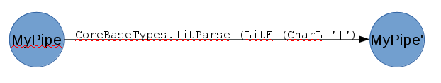
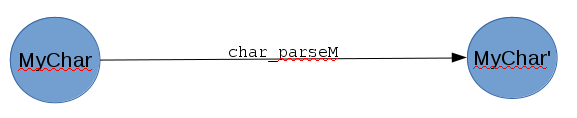
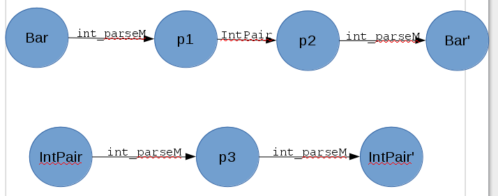
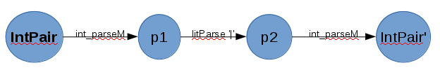
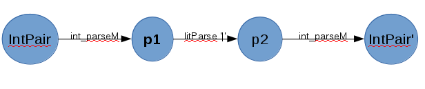
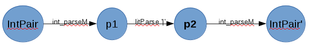
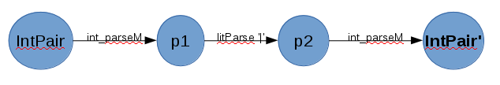

# Pads to ATN Conversion

## I. Overview of evaluation process for Pads descriptions

The following example walks through the sequence of actions performed when this
Pads description is evaluated:

```haskell 
[pads| type MyChar = Char |]
```

The quoted string is parsed by parsePadsDecls (defined in Parser). The
resulting value has type PadsDecl (defined in Syntax).

```haskell 
*Main> let myCharPadsDecl = parsePadsString typeDecl "type MyChar = Char" --utility function for demo purposes
*Main> 
*Main> :t myCharPadsDecl 
myCharPadsDecl :: PadsDecl
```

The value contains an AST representation of the MyChar type:

```haskell 
*Main> myCharPadsDecl 
PadsDeclType "MyChar" [] Nothing (PTycon ["Char"])  -- (PTycon ["Char"]) is the AST
```

The make_pads_declarations' function (defined in CodeGen) converts the Pads
declaration into a list of Haskell declaration ASTs wrapped in the Q monad:

```haskell 
*Main> let myCharDecls = make_pads_declarations' (const $ return []) [myCharPadsDecl]
*Main> 
*Main> :t myCharDecls 
myCharDecls :: Q [Dec]
```

Running the Q monad produces the actual Haskell declaration ASTs:

```haskell 
*Main> runQ myCharDecls 
[TySynD MyChar [] (ConT Char),TySynD MyChar_md [] (ConT Char_md),FunD myChar_parseM [Clause [] (NormalB (VarE char_parseM)) []],FunD myChar_parseS [Clause [] (NormalB (AppE (VarE Language.Pads.PadsParser.parseStringInput) (VarE myChar_parseM))) []],FunD myChar_printFL [Clause [TupP [VarP rep,VarP md]] (NormalB (AppE (VarE char_printFL) (TupE [VarE rep,VarE md]))) []],FunD myChar_def [Clause [] (NormalB (VarE char_def)) []],SigD myChar_printFL (ForallT [] [] (AppT (ConT Language.Pads.PadsPrinter.PadsPrinter) (AppT (AppT (TupleT 2) (ConT MyChar)) (ConT MyChar_md)))),SigD myChar_def (ForallT [] [] (ConT MyChar))]
```

These ASTs are then evaluated to introduce new bindings into the environment, such as the following function:

```haskell
*Main> :t myChar_parseS
myChar_parseS :: String -> ((Char, Base_md), String)
*Main> 
*Main> myChar_parseS "ab"
(('a',Base_md {numErrors = 0, errInfo = Nothing}),"b")
```

Here is the abstract syntax for the myChar_parseM and myChar_parseS functions that were generated:

```haskell
FunD myChar_parseM [Clause [] (NormalB (VarE char_parseM)) []]

FunD myChar_parseS [Clause [] (NormalB (AppE (VarE Language.Pads.PadsParser.parseStringInput) (VarE myChar_parseM))) []]
```

The first definition says that myChar_parseM is a function whose body contains
a single expression: the name of the built-in char_parseM function. The
myChar_parseS function is a partial application of PadsParser.parseStringInput
to myChar_parseM; the resulting function uses myChar_parseM to parse string
input.

## II. Generating parse functions from Pads descriptions, in detail

This section describes how the Haskell AST for myChar_parseM is created from the MyChar Pads declaration.

make_pads_declarations' calls genPadsDecl on the Pads declaration:

```haskell
make_pads_declarations' :: Derivation -> [PadsDecl] -> Q [Dec]
make_pads_declarations' derivation ds = fmap concat (mapM (genPadsDecl derivation) ds)
```

genPadsDecl calls genPadsParseM, passing the Pads declaration's fields as 
arguments:

```haskell
genPadsDecl derivation (PadsDeclType name args pat padsTy) = do
  let typeDecs = mkTyRepMDDecl name args padsTy
  parseM  <- genPadsParseM name args pat padsTy
  parseS  <- genPadsParseS name args pat
  printFL <- genPadsPrintFL name args pat padsTy
  def <- genPadsDef name args pat padsTy
  let sigs = mkPadsSignature name args (fmap patType pat)
  return $ typeDecs ++ parseM ++ parseS ++ printFL ++ def ++ sigs

*Main> let myCharDecls = genPadsDecl (const $ return []) myCharPadsDecl 
*Main> 
*Main> :t myCharDecls
myCharDecls :: Q [Dec]
```

genPadsParseM uses the PadsDecl's type AST to create the parse function's body.
It uses the PadsDecl's remaining fields to create the rest of the function.

```haskell
genPadsParseM :: UString -> [LString] -> Maybe Pat -> PadsTy -> Q [Dec]
genPadsParseM name args patM padsTy = do 
  body  <- genParseTy padsTy
  return [mkParserFunction name args patM body]

*Main> let myChar_parseM = genPadsParseM "MyChar" [] Nothing (PTycon ["Char"])
*Main> 
*Main> :t myChar_parseM
myChar_parseM :: Q [Dec]
*Main> 
*Main> runQ myChar_parseM
[FunD myChar_parseM [Clause [] (NormalB (VarE char_parseM)) []]]
```

genParseTy does case analysis on the PadsDecl's AST to produce the
parse function's body. Since the AST for the MyChar type is (PTycon ["Char"]), 
genParseTy choose the PTycon branch for this example.

```haskell
genParseTy :: PadsTy -> Q Exp
genParseTy pty = case pty of
    PConstrain pat ty exp   -> genParseConstrain (return pat) ty (return exp)
    PTransform src dest exp -> genParseTyTrans src dest (return exp)
    PList ty sep term       -> genParseList ty sep term
    PPartition ty exp       -> genParsePartition ty exp
    PValue exp ty           -> genParseValue exp
    PApp tys argE           -> genParseTyApp tys argE
    PTuple tys              -> genParseTuple tys
    PExpression exp         -> genParseExp exp
    PTycon c                -> return $ mkParseTycon c
    PTyvar v                -> return $ mkParseTyvar v

*Main> let myChar_parseM_body = genParseTy (PTycon ["Char"])
*Main> 
*Main> :t myChar_parseM_body
myChar_parseM_body :: Q Exp
*Main> 
*Main> runQ myChar_parseM_body 
VarE char_parseM
```

mkParseTycon creates a Template Haskell VarE expression with the result of
calling mkTyParserQName on the type constructor's name.

```haskell
mkParseTycon :: QString -> Exp
mkParseTycon ["EOF"] = VarE 'eof_parseM
mkParseTycon ["EOR"] = VarE 'eor_parseM
mkParseTycon c     = VarE (mkTyParserQName c)

*Main> let myChar_parseM_body' = mkParseTycon ["Char"]
*Main> 
*Main> :t myChar_parseM_body'
myChar_parseM_body' :: Exp
*Main> 
*Main> myChar_parseM_body'
VarE char_parseM
```

mkTyParserQName simply converts the type constructor to a name with "_parseM"
at the end.

```haskell
mkTyParserQName  str = mkName (appendLower str "_parseM")

*Main> let funcName = mkTyParserQName ["Char"]
*Main> 
*Main> :t funcName
funcName :: Name
*Main> 
*Main> funcName
char_parseM
```

The name that mkTyParserQName creates, char_parseM, is also the name of a function
in CoreBaseTypes.hs:

```haskell
char_parseM :: PadsParser (Char, Base_md)
char_parseM  =
  handleEOF def "Char" $
  handleEOR def "Char" $ do
    c <- takeHeadP
    returnClean c
```

This means that when myChar_parseM is applied (within myChar_parseS in the 
example below), it in turn calls char_parseM.

```haskell
*Main> myChar_parseS "ab"
(('a',Base_md {numErrors = 0, errInfo = Nothing}),"b")
```

If the type constructor name that appears in the Pads description does not
correspond to a predefined Pads function name, a compile-time error occurs.

```haskell
[pads| type MyChar = Cha |] -- typo

*Language.Pads.Testing> :l ~/projects/antlr/allstar/PadsToAtn.hs
...
~/projects/antlr/allstar/PadsToAtn.hs:27:7:
    Not in scope: ‘cha_parseM’
    Perhaps you meant one of these:
      ‘char_parseM’ (imported from Language.Pads.Padsc),
      ‘int_parseM’ (imported from Language.Pads.Padsc),
      ‘try_parseM’ (imported from Language.Pads.Padsc)
```
## III. Internal representations of other Pads descriptions

This section describes the internal representations of several Pads
descriptions from First.hs. The goal is to provide examples of the
different Pads types, which are shown below:

```haskell
data PadsTy = PConstrain Pat PadsTy Exp
            | PTransform PadsTy PadsTy Exp
            | PList PadsTy (Maybe PadsTy) (Maybe TermCond)
            | PPartition PadsTy Exp
            | PValue Exp PadsTy
            | PApp [PadsTy] (Maybe Exp)
            | PTuple [PadsTy] 
            | PExpression Exp
            | PTycon QString
            | PTyvar String
   deriving (Eq, Data, Typeable, Show)
```

### 1. PTycon, PExpression, and PTuple

In the example from Sections I and II, the MyChar Pads description has a PTycon ["Char"] representation.
The IntPair Pads description below has a representation that combines PTycon, PExpression,
and PTuple types.

```haskell
[pads| type IntPair = (Int, '|', Int) |]

*Main> let intPairPD = parsePadsString typeDecl "type IntPair = (Int, '|', Int)"
*Main> 
*Main> intPairPD
PadsDeclType "IntPair" [] Nothing (PTuple [PTycon ["Int"],PExpression (LitE (CharL '|')),PTycon ["Int"]])
*Main> 
*Main> let intPair_parseM_body = genParseTy (PTuple [PTycon ["Int"],PExpression (LitE (CharL '|')),PTycon ["Int"]])
*Main> 
*Main> runQ intPair_parseM_body
LetE [FunD f_rep [Clause [VarP x1,VarP x3] (NormalB (TupE [VarE x1,VarE x3])) []],FunD f_md [Clause [VarP x1,VarP x2,VarP x3] (NormalB (TupE [AppE (VarE Language.Pads.MetaData.mergeBaseMDs) (ListE [AppE (VarE Language.Pads.MetaData.get_md_header) (VarE x1),AppE (VarE Language.Pads.MetaData.get_md_header) (VarE x2),AppE (VarE Language.Pads.MetaData.get_md_header) (VarE x3)]),TupE [VarE x1,VarE x2,VarE x3]])) []]] (InfixE (Just (InfixE (Just (InfixE (Just (AppE (VarE GHC.Base.return) (TupE [VarE f_rep,VarE f_md]))) (VarE Language.Pads.PadsParser.=@=) (Just (VarE int_parseM)))) (VarE Language.Pads.PadsParser.=@) (Just (AppE (VarE Language.Pads.CoreBaseTypes.litParse) (LitE (CharL '|')))))) (VarE Language.Pads.PadsParser.=@=) (Just (VarE int_parseM)))
```

The abstract syntax is complicated, but it looks like the important parts are the calls to int_parseM,
litParse (partially applied to the character '|'), and int_parseM again. 

To see more clearly how the PExpression Pads type is handled, we can write a simpler
Pads description that includes a single character: 

```haskell
*Main> let myPipePD = parsePadsString typeDecl "type MyPipe = '|'"
*Main> 
*Main> myPipePD
PadsDeclType "MyPipe" [] Nothing (PExpression (LitE (CharL '|')))
*Main> 
*Main> let myPipe_parseM_body = genParseTy (PExpression (LitE (CharL '|')))
*Main> 
*Main> runQ myPipe_parseM_body
AppE (VarE Language.Pads.CoreBaseTypes.litParse) (LitE (CharL '|'))
```

The body of the myPipe_parseM function is just the partial application of the
litParse function to the LitE wrapped by the PExpression.

Here is a simpler example of a PTuple:

```haskell
*Main> let charPairPD = parsePadsString typeDecl "type CharPair = (Char, Char)"
*Main> 
*Main> charPairPD 
PadsDeclType "CharPair" [] Nothing (PTuple [PTycon ["Char"],PTycon ["Char"]])
*Main> 
*Main> let charPair_parseM_body = genParseTy (PTuple [PTycon ["Char"],PTycon ["Char"]])
*Main> 
*Main> runQ charPair_parseM_body 
LetE [FunD f_rep [Clause [VarP x1,VarP x2] (NormalB (TupE [VarE x1,VarE x2])) []],FunD f_md [Clause [VarP x1,VarP x2] (NormalB (TupE [AppE (VarE Language.Pads.MetaData.mergeBaseMDs) (ListE [AppE (VarE Language.Pads.MetaData.get_md_header) (VarE x1),AppE (VarE Language.Pads.MetaData.get_md_header) (VarE x2)]),TupE [VarE x1,VarE x2]])) []]] (InfixE (Just (InfixE (Just (AppE (VarE GHC.Base.return) (TupE [VarE f_rep,VarE f_md]))) (VarE Language.Pads.PadsParser.=@=) (Just (VarE char_parseM)))) (VarE Language.Pads.PadsParser.=@=) (Just (VarE char_parseM)))
```

### 2. References to other Pads types

This example shows the internal representation of a Pads type
that makes reference to a previously defined Pads type.

```haskell
*Main> let barPD = parsePadsString typeDecl "type Bar = (Int, ',', IntPair, ';', Int)"
*Main> 
*Main> barPD
PadsDeclType "Bar" [] Nothing (PTuple [PTycon ["Int"],PExpression (LitE (CharL ',')),PTycon ["IntPair"],PExpression (LitE (CharL ';')),PTycon ["Int"]])
```

The reference to the IntPair Pads type is represented as a PTycon ["IntPair"].

### 3. PApp and PTyvar

The representation of the Baz type below is an application (PApp) of an
existing Pads type constructor, Line, to another Pads type.

```haskell
*Main> let bazPD = parsePadsString typeDecl "type Baz = Line (Int, ',', Int)"
*Main> 
*Main> bazPD
PadsDeclType "Baz" [] Nothing (PApp [PTycon ["Line"],PTuple [PTycon ["Int"],PExpression (LitE (CharL ',')),PTycon ["Int"]]] Nothing)
*Main> 
*Main> let baz_parseM_body = genParseTy (PApp [PTycon ["Line"],PTuple [PTycon ["Int"],PExpression (LitE (CharL ',')),PTycon ["Int"]]] Nothing)
*Main> 
*Main> runQ baz_parseM_body 
AppE (VarE line_parseM) (LetE [FunD f_rep [Clause [VarP x1,VarP x3] (NormalB (TupE [VarE x1,VarE x3])) []],FunD f_md [Clause [VarP x1,VarP x2,VarP x3] (NormalB (TupE [AppE (VarE Language.Pads.MetaData.mergeBaseMDs) (ListE [AppE (VarE Language.Pads.MetaData.get_md_header) (VarE x1),AppE (VarE Language.Pads.MetaData.get_md_header) (VarE x2),AppE (VarE Language.Pads.MetaData.get_md_header) (VarE x3)]),TupE [VarE x1,VarE x2,VarE x3]])) []]] (InfixE (Just (InfixE (Just (InfixE (Just (AppE (VarE GHC.Base.return) (TupE [VarE f_rep,VarE f_md]))) (VarE Language.Pads.PadsParser.=@=) (Just (VarE int_parseM)))) (VarE Language.Pads.PadsParser.=@) (Just (AppE (VarE Language.Pads.CoreBaseTypes.litParse) (LitE (CharL ',')))))) (VarE Language.Pads.PadsParser.=@=) (Just (VarE int_parseM))))
```

The Line type is defined in BaseTypes.hs, but we can redefine it
to inspect its internal representation:

```haskell
*Main> let myLine = parsePadsString typeDecl "type Line a   = (a, EOR)"
*Main> 
*Main> myLine
PadsDeclType "Line" ["a"] Nothing (PTuple [PTyvar "a",PTycon ["EOR"]])
*Main> 
*Main> let myLine_parseM_body = genParseTy (PTuple [PTyvar "a",PTycon ["EOR"]])*Main> 
*Main> runQ myLine_parseM_body 
LetE [FunD f_rep [Clause [VarP x1] (NormalB (TupE [VarE x1])) []],FunD f_md [Clause [VarP x1,VarP x2] (NormalB (TupE [AppE (VarE Language.Pads.MetaData.mergeBaseMDs) (ListE [AppE (VarE Language.Pads.MetaData.get_md_header) (VarE x1),AppE (VarE Language.Pads.MetaData.get_md_header) (VarE x2)]),TupE [VarE x1,VarE x2]])) []]] (InfixE (Just (InfixE (Just (AppE (VarE GHC.Base.return) (TupE [VarE f_rep,VarE f_md]))) (VarE Language.Pads.PadsParser.=@=) (Just (VarE a__p)))) (VarE Language.Pads.PadsParser.=@) (Just (VarE Language.Pads.CoreBaseTypes.eor_parseM)))
```

Line takes a type parameter, which is why it can be applied to a PTuple type in the Baz example.

## IV. Converting Pads descriptions to ATNs

This section describes an approach to converting a Pads description's internal representation
to an ATN structure that the ALL(*) parsing algorithm takes as input. The approach involves modifying the ATN representation described in [Adaptive LL(*) Parsing: The Power of Dynamic Analysis](http://delivery.acm.org/10.1145/2670000/2660202/p579-parr.pdf?ip=130.64.22.2&id=2660202&acc=ACTIVE%20SERVICE&key=AA86BE8B6928DDC7%2E4579F4D1C4C67060%2E4D4702B0C3E38B35%2E4D4702B0C3E38B35&CFID=784083305&CFTOKEN=44745320&__acm__=1499721527_57e2721c81d5a393c4bd1bea5025b994)
in several ways. First, terminal edges, rather than being labeled with terminal symbols, are labeled
with primitive Pads functions that inspect the input data (such as char_parseM). Second, each ATN includes
a function to be performed on the subtrees produced by traversing that ATN (an example will make this clearer).

### 1. PExpressions and built-in PTycons

A PExpression's corresponding ATN has an edge labeled with the function
that parses the literal expression wrapped by the PExpression, as shown
below:



The ATN for a built-in Pads type constructor is similar; it has an edge
labeled with the built-in _parseM function:



### 2. References to other Pads types

A Pads type that refers to another Pads type has an ATN with a nonterminal edge
that is labeled with the other Pads type's ATN. In other words, the referred-to
ATN is treated as a submachine.



### 3. PTuples and other compound types

In an ATN representation of a Pads tuple type, the final state is labeled with
a function that takes a list of parse trees (the subtrees produced by traversing
the ATN's edges) and returns a tuple that contains them. This tuple example
reflects the general approach to implementing parsers that return compound or
aggregate values--once the parsing algorithm reaches the end of a production, 
it applies an aggregating function to the subtrees produced by that production.

The next example illustrates this process:

At the first stage of applying the production, we haven't examined the input sequence
and the stack of subtrees is empty.



input = "4|33"    stack = []

When we traverse the first ATN edge, we successfully apply int_parseM to the input
and push the result onto the stack.



input = "|33"    stack = [4]

When we traverse the second ATN edge, we successfully apply (litParse '|') to the input
and push the result onto the stack.



input = "33"    stack = ['|', 4]

When we traverse the third ATN edge, we successfully apply int_parseM to the input again
and push the result onto the stack.



input = ""    stack = [33, '|', 4]

At this point, the ATN cursor is pointing to a final state, so we apply the aggregation function
associated with the final state to the subtrees on the stack.


